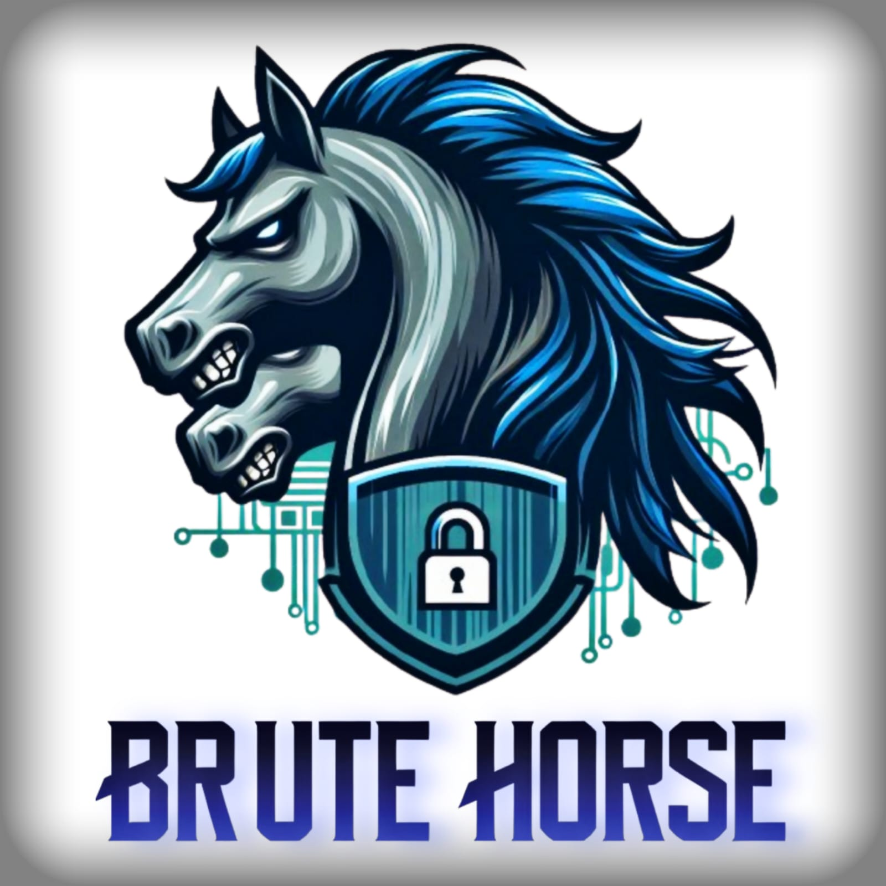

# Brute-Horse
An automation pentesting interface that allows the disclosure of vulnerabilities in systems & even exploiting them

 

## Expected Functionalities after project end
### For user-input IP address
1. Port Scanning 🕵️‍♂️
- Applying port scanning using nmap & reporting open ports and vulnerabilites
2. Exploiting vulnerabilities 🔓 
  1. anonymous FTP login 
  2. anonymous SMB login
  3. Bruteforce attack on open ports as SSH, SMB, FTP, etc...
### For web pages
1. Information Gathering 📋
   1. Directory Enumeration
   2. Banner Grapping
2. Scanning for vulnerabilites 🔎
3. Exploitation 🔥
   1. SQLI for found forms & search bars

## Contributers

|  |  |  |  |
| ------------------------------------------------------------------------------------------------- | ----------------------------------------------------------------------------------------- | ------------------------------------------------------------------------------------------- | ------------------------------------------------------------------------------------------- |
| [AbdelruhmanSamy](https://github.com/AbdelruhmanSamy/)                                            | [AshrafBahy](https://github.com/Ashraf-Bahy)                                              | [AhmedMostafa](https://github.com/New-pro125)                                                  | [NesmaOsama](https://github.com/Nesma-Osama)                                         |
